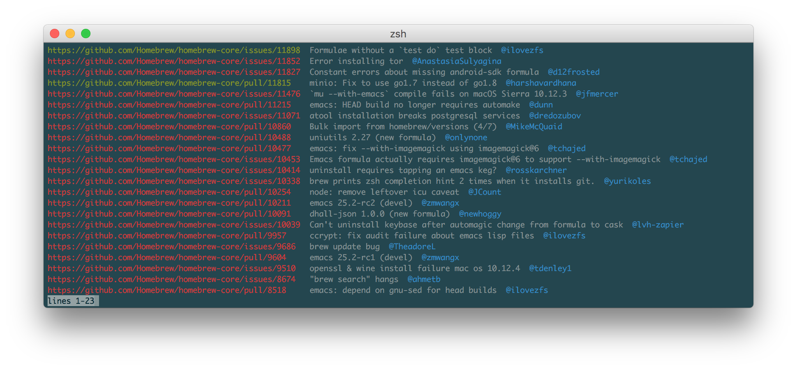

# Homebrew Track

Search homebrew/core's issue/pr trackers from the command line.

## Dependencies

- Python 3.6 or later (`brew install python3`);
- [`github3.py`](https://github.com/sigmavirus24/github3.py) (`pip install github3.py`).

## Installation

```
brew tap zmwangx/track
```

## Usage

```
usage: brew-track [-h] [--color {auto,always,never}]
                  [--pager {auto,always,never}] [--debug] [--issue | --pr]
                  [--open | --closed] [--title-only | --title-and-body-only]
                  keywords [keywords ...]

Search for Homebrew/homebrew-core issues and prs.

positional arguments:
  keywords              search keyword(s)

optional arguments:
  -h, --help            show this help message and exit
  --color {auto,always,never}
                        whether to color the output
  --pager {auto,always,never}
                        whether to use a pager; the default is 'auto', where a
                        pager is only used if the output is longer than a
                        screenful
  --debug               print debugging information
  --issue               restrict to issues
  --pr                  restrict to prs
  --open                restrict to open issues/prs
  --closed              restrcit to closed issues/prs
  --title-only          restrict search to titles
  --title-and-body-only
                        restrict search to titles and bodies
```

## Screenshots

Without pager:


With pager:


